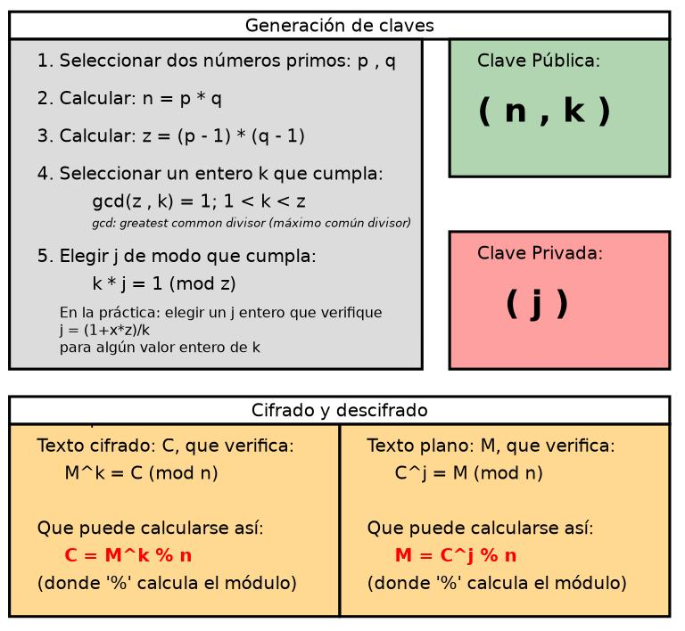

El cifrado asimétrico es posiblemente una de las técnicas de criptografía más potentes que se usan actualmente. Esto se debe a que se usan dos claves independientes una de otra, mientras que en el cifrado simétrico solo se usa una que puede caer en manos equivocadas. A lo largo de este artículo veremos un poco como funciona, para poder comprenderlo mejor.

## ¿Qué es el cifrado asimétrico?

Como hemos visto en la introducción a este artículo existen diferentes tipos de cifrado, en este caso nos centraremos en el asimétrico y en porque este es tan usado en la actualidad, para ello usaremos el ejemplo de un mensaje.
Las clave asimétrica basan su fortaleza en ser dos claves independientes pero necesarias entre ellas para cifrar/descifrar el mensaje, una se conocerá como la clave pública y la otra será conocida como la clave privada. Esto permitirá el envío de un mensaje cifrado que solamente podrá leer la otra parte de la clave, a continuación veremos un ejemplo de su funcionamiento así como una breve explicación del apartado técnico detrás de este proceso.

<!--truncate-->

### Funcionamiento del cifrado asimétrico

Entender cómo funciona este cifrado requiere un poco de imaginación, para este ejemplo digamos que queremos pasar un mensaje a nuestro vecino Antonio, pero no queremos que nadie vea dicho mensaje. Para hacer este proceso seguimos un orden muy sencillo:

1. Obtenemos la clave pública de Antonio, normalmente de un servidor de claves pero puede ser obtenida de cualquier forma.
2. Ciframos este mensaje con la clave pública de Antonio, esto hará imposible leer dicho mensaje a no ser que tengamos la otra clave, de hecho este mensaje sería imposible ser descifrado por nosotros al no tener la clave privada.
3. Antonio cuando recibe dicho mensaje puede descifrarlo con su clave privada para leerlo.
Como hemos podido ver es un proceso sencillo, la idea consiste en mandar un mensaje que solo la otra persona pueda ver, ninguna persona más podría leer dicho mensaje sin tener la clave privada. 

:::tip Consejo de seguridad
Como habéis podido deducir, la clave privada jamás se le debe pasar a nadie, la protección de dicha clave es primordial, en caso de ser comprometida podrían leerse todos los mensajes cifrados con la clave pública pareja de la privada.
:::

### Como se crean las claves con el algoritmo RSA

Una vez hemos entendido el funcionamiento de este tipo de cifrado, hablamos sobre el procedimiento técnico que permite que esto suceda. Como vemos en el título de este apartado nos centraremos en el algoritmo “RSA” que son las iniciales de sus tres creadores Rievst, Shamir y Adleman. Aunque existen otros algoritmos diferentes basados en el mismo principio de dos claves, este es tal vez el más usado.

:::tip Detalle a tener en cuenta
Este tipo de algoritmos tienen un cálculo de creación, más o menos sencillos pero el cálculo para deshacerlo haría falta mucha capacidad de cálculo o potencia de cálculo computacional. Esto se le conoce como un método de criptografía de un único sentido.
:::

El cálculo para poder crear una clave de cifrado RSA se basa en el uso de números [**primos**](https://es.wikipedia.org/wiki/N%C3%BAmero_primo), [**coprimos**](https://es.wikipedia.org/wiki/N%C3%BAmeros_coprimos) y una operación conocida como módulo. Esta operación se basa en el resto que da una división. Usaremos de ejemplo números pequeños, esto se hace con números realmente grandes y con un relleno de bits al cifrar. Yo intentaré explicarlo de una forma sencilla y entendible. A continuación dejaré una imagen con un esquema que vamos a intentar explicar.

:::caution Ejemplificación de las ecuaciones
Las ecuaciones como $3*27=1\;(mod\;40)$ que veremos más adelante realmente se escriben $3*27=1\;(40)$, yo especifico el mod para que se tenga una imagen más clara de la operación que se está realizando.
:::

1. Cuando decidimos crear nuestra clave, el algoritmo RSA se crearán dos claves públicas, una contendrá el valor de $e$ y $n$, en este caso la parte pública, y la privada contendrá el valor de $d$ y $n$. Estos valores permitirán hacer un cálculo que cifrara el mensaje y en el caso de la privada un cálculo que descifrara dicho mensaje. A continuación veremos cómo se crean dichos valores.
2. Primero usará dos números primos, que llamaremos $p$ y $q$. En mi caso el valor de estos números son 5 y 11 respectivamente.
3. Con los números anteriores obtendremos dos valores, primero se obtendrá el valor de “n” con la fórmula de $n=p*q$, o lo que sería en nuestro caso es $n=5*11$, dando como resultado el valor 55.
4. El segundo valor sería $φ$, esto se conoce como [**“Phi de Euler”**](https://es.wikipedia.org/wiki/Funci%C3%B3n_%CF%86_de_Euler) la cual podemos resumir de una forma muy básica en que nos permitirá calcular un número primo válido. Esto lo haríamos con la fórmula $φ=(p-1)*(q-1)$, que en nuestro caso quedaría como $φ=(5-1)*(q-1)$ dando el valor de “40”.
5. Llegado a este punto nos encontramos que tenemos dos valores uno es $n$ que es el 55 y $φ$ que tiene el valor de 40. Con esto realizaremos unos cálculos para poder obtener el valor de $e$ que llevará la clave pública y el valor de $d$ que llevará la clave privada. 
6. El valor de $e$ será bastante sencillo pues solamente habrá que obtener un número que sea coprimo del valor de $φ$, esto se haría con el [**“Algoritmo de Euclides”**](https://es.wikipedia.org/wiki/Algoritmo_de_Euclides), pero al igual que en el caso anterior resumiré esto de una forma muy básica. En nuestro caso tenemos que encontrar un número que al dividir por el valor de “φ” aplicando la operación del [**"máximo común divisor(mcd)"**](https://es.wikipedia.org/wiki/M%C3%A1ximo_com%C3%BAn_divisor) de como resultado final “1”. Con esto ya tendríamos el valor de la clave pública que sería $(e,n)$ o lo que es lo mismo $(3,55)
7. Ahora vendría la otra clave, la que conocemos como clave privada. Esta es un poco más compleja de entender, pues se hace uso del [**"módulo inverso"**](https://es.wikipedia.org/wiki/Inverso_multiplicativo_(aritm%C3%A9tica_modular)) el cual también es calculado con el [**“Algoritmo de Euclides”**](https://es.wikipedia.org/wiki/Algoritmo_de_Euclides), pero en nuestro caso vamos a simplificarlo para un mayor entendimiento. En nuestro ejemplo tenemos que $e$ tiene un valor de 3, y la operación a realizar para obtener el valor de $d$ sería $d inv (e,φ)$.Esta fórmula al final se puede reducir en una ecuación de [**"congruencia lineal"**](https://es.wikipedia.org/wiki/Teorema_de_congruencia_lineal), este tipo de ecuaciones usan valores al que realizamos la operación mod y nos devuelve el mismo valor. Por poner un ejemplo digamos que tenemos $11=26\;(mod\;5)$, en este caso ambos valores que nos devolverá la operación módulo, será “1” en ambos números, por lo que son congruentes entre ellos. Es un concepto algo complicado de entender debido que esa congruencia cambia según la operación a realizar, ya que $11=26\;(mod\;6)$ ya no sería congruente por ejemplo porque devolverá el valor “5 y 2”. Digamos que según el momento esos números están dentro de la misma caja o no lo están.
8. Ahora volviendo a nuestro caso, tenemos que encontrar un número que al ser el [**"multiplicador inverso"**](https://es.wikipedia.org/wiki/Inverso_multiplicativo_(aritm%C3%A9tica_modular)) junto a $e$ usando de módulo $φ$ nos devuelva el mismo valor, esto es posible gracias a que uno es coprimo del otro, si no sería totalmente imposible. La operación a realizar sería la siguiente ecuación de [**"congruencia lineal"**](https://es.wikipedia.org/wiki/Teorema_de_congruencia_lineal) $e*d=1\;(mod\;φ)$, en nuestro caso sería $3*27=1\;(mod\;40)$. Al realizar el mod 40, sobre $3*27$ devuelve uno. El valor de $d$ nunca puede ser mayor o igual a 40 en este caso, simplemente habría que ir probando numero por numero, aunque esto no es eficiente ni útil para números grandes y por eso mismo existe el [**“Algoritmo de Euclides”**](https://es.wikipedia.org/wiki/Algoritmo_de_Euclides).
9. Ya obtenido el valor de $d$ tendremos la parte privada de la clave que sería $(d,n)$ en nuestro caso $(27,55)$.

:::info Curiosidad sobre el cifrado
Al usar números primos enormes con más de 100 dígitos ir probando número por número para dar con el valor de $d$ es casi imposible en la computación actual, al menos la que no es cuántica. Por eso mismo es tan importante proteger la clave privada, pues nadie sin ese valor les resulta imposible volver hacia atrás el cifrado, es muy fácil cifrar el fichero pero muy complejo regresar hacia atrás sin el valor de la clave privada.
:::

### Como se cifra y descifra el mensaje con el algoritmo RSA

Ya llegados a este punto habremos pasado a la parte más complicada que es como se crea, ahora veremos cómo se cifra o descifra, vamos a ver los dos casos. Para ello usaremos estas fórmulas:

* Para cifrar: $c=m^e\;mod\;n$
* Para descifrar: $m=c^d\;mod\;n$

Cifrado: Pongamos que queremos mandar un mensaje, que este será el valor $m$ en las ecuaciones, nosotros mandamos el numero 2, para ellos realizamos la ecuación $c=2^3\;(mod\;55)$ que nos daría el valor 8 y esto sería lo que enviamos a la otra persona.
Descifrado: La persona que recibe el mensaje cifrado con su clave pública, lo descifrara con su clave privada usando la siguiente ecuación $m=8^27\;(mod\;55)$ que nos daría como resultado el número 2.
Como hemos podido ver de la forma más sencilla posible que he podido así funciona el algoritmo RSA.

## Firmas con nuestra clave

:::caution Aviso
A partir de este punto doy por hecho que entendemos como funciona los apartados anteriores por lo que será algo más breve.
:::

La firma sigue el mismo proceso visto anteriormente, solo que en vez de cifrar con la clave pública, se hace un cifrado con la clave privada, a esto se le conoce como firmar. En todo este proceso como hemos podido darnos cuenta, lo que se cifra con una clave solo puede ser descifrado con la otra clave debido a la forma en la que funciona esta metodología. Al cifrar con una clave pública que podemos obtener desde cualquier lugar público, estamos dando acceso a ese fichero solamente al dueño de la clave privada asociada a dicha clave. Pero si lo hacemos al revés y ciframos usando la clave privada, cualquier persona con la clave pública podrá leer el fichero.

Estos dos casos aunque parecidos son diferentes, en el primer caso buscamos que ese fichero solamente pueda leerlo una persona. Mientras que en el segundo caso lo puede leer cualquier persona que tenga la clave pública ya que la intención es la de asegurar que ese fichero es nuestro. Como solo nosotros poseemos nuestra propia clave privada, o así debería ser estamos dando la autenticidad que ese mensaje o fichero es nuestro, ya que solo nosotros podríamos firmar(cifrar) con nuestra clave privada.

:::tip Atención
Aunque el uso u objetivo es diferente, realmente ambos caso el fichero no resultara legible porque estará cifrado.
:::

## Autoridades certificadoras

Todo este sistema de claves se basa en la confianza de quien posee la clave privada. Por ejemplo, si yo cifrar un fichero con una clave pública, pero una persona más aparte del dueño de dicha clave tiene la parte privada, la seguridad estará comprometida. Lo mismo para las firmas, si otra persona firma con la clave privada de otro estará comprometida la autenticidad de dicha firma.

Al final ningún sistema de seguridad es perfecto, aunque en este caso tenemos una capa más que serían las autoridades certificadoras. Estos “organismos” en los que presuponemos no han sido comprometidos nos proporcionará un grado más de confianza en la autenticidad de las firmas.
Esto funciona de la siguiente forma, nosotros vamos a una entidad acreditada para emitir certificados, esta entidad nos proporcionará un certificado que se compone de nuestra clave pública y de la firma de ellos con su clave privada. 

Esto permite crear una red de confianza lo cual es el mayor fallo de este método de criptografía, saber si esa persona realmente es quien dice que es. Ahora con el certificado si otra persona nos pasa su clave pública suplantando a otra persona podremos comprobarlo con el certificado, este certificado no lo puede falsificar, ya que no puede firmar con la clave privada de la entidad autorizada para certificar. Aunque al igual que el caso anterior tendremos que confiar en esa autoridad certificadora.

:::tip Curiosidad
Nosotros mismos podemos crear un anillo de confianza con las claves de las personas en las que confiamos, así como ver que ha sido aprobada por otras personas de confianza y asegurarnos de la autenticidad. Aunque como en todos los casos la confianza en otras personas será esencial.
:::

Espero que este artículo haya sido útil para entender un poco más del cifrado asimétrico, también os será útil para entender las 3 tareas sobre el cifrado.