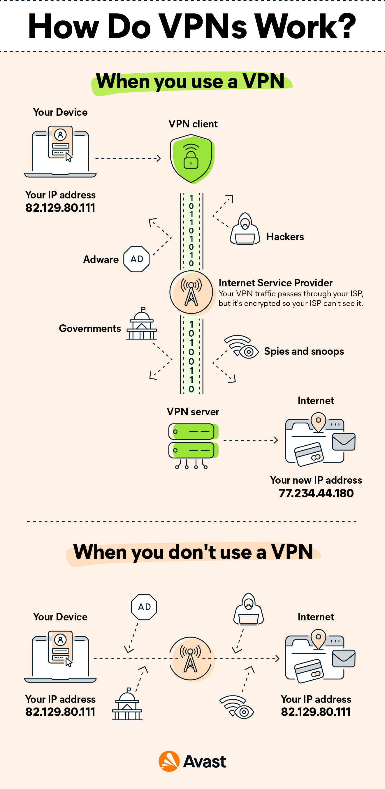
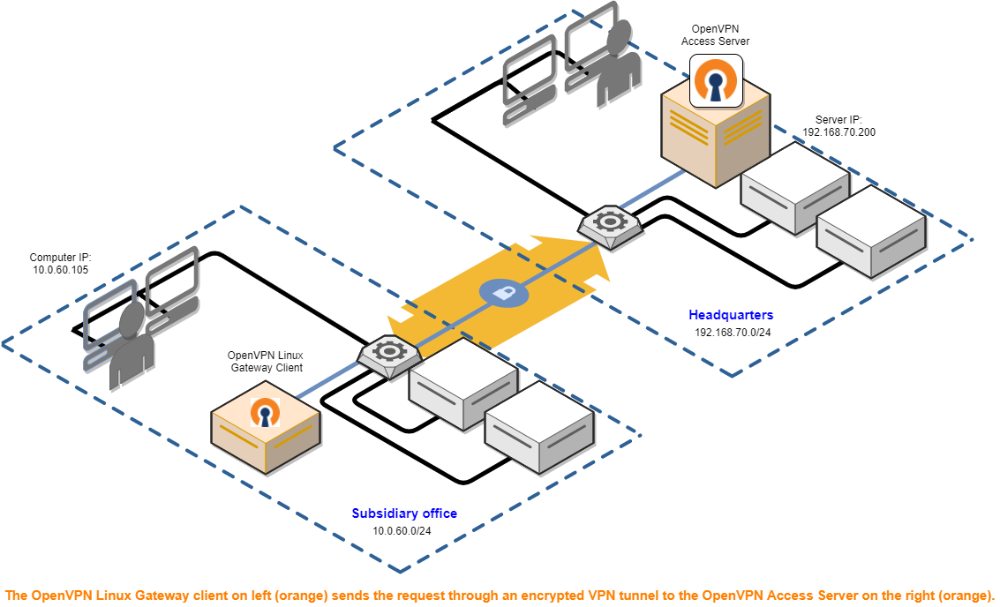

Podríamos empezar por explicar que una VPN es una conexión segura entre un punto y otro. Iremos viendo los tipos de vpn mas usado asi como su funcionamiento.Podriamos empezar por explicar que una VPN es una conexión segura entre un punto y otro punto. 

La seguridad puede cambiar según la configuración pero el método más actual es usar certificados basado en criptografía asimétrica, que podemos ver explicado en este [**“articulo sobre cifrado asimetrico”**](https://www.davidrgfoss.com/blog/Cifrado%20asimetrico) que yo escribí. Muy necesario leerlo para entender este artículo.

<!--truncate-->

## ¿Qué es una VPN?

Las VPN nacieron por la necesidad de que los empleados pudieran acceder a la red interna de una empresa de forma segura. Esta conexión permite a los usuarios usar la red interna de dicha empresa como si estuviesen en su puesto de trabajo. Esto es posible gracias a lo visto anteriormente sobre la criptografía asimétrica, aunque inicialmente se usaban claves compartidas u otros métodos. No deja de ser un método para interconectar dos redes que no están conectadas de forma física y directa.

Pongamos de ejemplo la anterior imagen que pertenece a la empresa “Avast”. En ella nos expone dos casos diferentes, en uno se usa VPN y en el otro no. Cuando no se usa como podemos ver tenemos una conexión entre dos máquinas, pero en el trayecto de esa conexión vemos que terceras partes pueden ver el contenido de los mensajes enviados o recibidos. Aunque en la actualidad esa conexión puede estar protegida de otras formas diferentes.
Luego tenemos el caso contrario, el cliente se conecta desde el punto “VPN client” y este genera una conexión cifrada con “VPN server” que está conectado en la máquina destino. Como podemos ver entre “VPN client” y “VPN server” todos los datos parecen ir por un túnel cifrado, aparte en el destino tiene una dirección IP diferente.

En resumen esto sería en esencia la finalidad de una “VPN”, hay que destacar que existen diversos métodos de configuración, este de la imagen sería conocido como “acceso remoto (access remote)”, pero a continuación también veremos otro como es el “sitio a sitio (peer to peer)”.

:::info Curiosidad
El cambio de dirección ip de la máquina origen se debe al uso de la propia vpn, la cual nos permite acceder a una red diferente a la nuestra como si estuviésemos físicamente allí. Digamos que mientras usamos la vpn aquí descrita es posible que el destino crea que nuestra máquina esté hasta en otro país.
:::

### Tipos de VPN

Dentro de lo que es una VPN podríamos definir diferentes tipos según su forma de funcionar o configuración, las más usadas que he mencionado en el punto anterior sería las de “acceso remoto” y “sitio a sitio”. Ahora ambas un poco más.

#### Acceso remoto

Estas suelen ser las más común para el usuario estándar, pues la mayoría de soluciones “VPN” comerciales la ofrecen de este tipo. Estas consisten en que yo que me encuentro en el punto “A” y que me quiero conectar a internet que en este caso sería el punto “C” no lo hagamos de forma directa.
Al usar una solución “VPN” en este caso nuestra máquina tendrá configurado un programa como cliente, esto permitirá que nuestra máquina se conecte a otra red como si estuviese físicamente allí. En el caso anterior el uso que se le daría es acceder desde esa otra red a internet, aunque puede llegar a ser muy parecido al siguiente tipo “sitio a sitio” realmente pertenecería al acceso remoto por su funcionamiento.

Su funcionamiento se puede resumir en:
1. Máquina local se conecta a otra red con el programa cliente.
2. Hacemos una conexión hasta el servidor destino permitiéndonos que estemos conectado como si estuviésemos en esa red.
3. Accedemos a internet desde esa ubicación física pero de forma remota desde nuestra ubicación real.

:::info Seguridad de los datos
Nuestros datos están protegidos desde el cliente al servidor, pero es posible acceder a ellos en el trayecto de nuestra máquina al programa cliente, y desde la red del servidor a la máquina del recurso solicitado. Esto se debe a que el cifrado que se ofrece tiene que ser cifrado por el cliente y descifrado por el servidor destino, pero no debemos preocuparnos ya que esa seguridad es una capa sobre la seguridad ya existente de otros protocolos como es “HTTPS”.
:::

#### Sitio a sitio

Esta es la segunda opción más utilizada, y por su forma de funcionar será más usada por empresas que por clientes particulares. A continuación dejaré la imagen que vamos a usar como guía visual para la explicación.

Como podemos ver en este caso tenemos dos redes diferentes conectadas por un túnel intermedio, puede recordarnos mucho al acceso remoto descrito anteriormente pero tiene una diferencia bastante notoria. Este tipo de configuración no tiene como objetivo que una máquina acceda a otra red como si estuviese físicamente dentro de dicha red, si no que el objetivo de este método es hacer que dos redes que no están juntas físicamente estén conectadas ambas como si formasen parte de la misma red. Aunque el funcionamiento final puede ser similar a tener dos redes interconectadas por un router, en este caso se añade una capa de protección aplicando uno de los diferentes tipos de cifrado disponibles como puede ser los visto en este artículo.

Las máquinas de los usuarios no harán uso de un programa cliente, si no que se configurara dos máquinas que serán las encargadas de generar un túnel “VPN” entre ellas, estas máquinas cogerán cualquier petición de las máquinas de su red que vayan hacia la otra red y se encargan de enviarlo una a otras.
Para que todo esto sea posible se hará uso de una tabla de enrutamiento, pues las máquinas de una red deben enviar la petición a la otra red sabiendo que esas peticiones deben pasar por estas dos máquinas respectivamente.

Esto se solía configurar con dos máquinas haciendo de servidor, aunque a día de hoy se puede configurar con una haciendo de servidor y la otra siendo un cliente de esta red, convirtiéndose así en una mezcla entre el acceso remoto y el método de sitio a sitio.
Este método tiene la ventaja que cualquier máquina conectada en una de esas dos redes puede acceder a los recursos de la otra como si estuviesen ambas dentro de la misma red, pero no nos permitiría acceder desde fuera a esta red como si estuviésemos físicamente allí.

:::info Información extra
El uso de este tipo de red, no está limitado a un origen y destino como es en el caso del acceso remoto, pues podemos tener diferentes redes conectadas usando el método de sitio a sitio, e incluso permitir el acceso remoto a estas redes. Al final la combinación de servicios permite un abanico amplio de posibilidades según nuestras necesidades.
:::

## Herramientas para crear VPNs

Existen una gran variedad de herramientas para poder realizar lo que hemos explicado a lo largo de este artículo, generalmente un usuario medio contrata un servicio que le ofrece un cliente con datos de acceso y todo está automatizado. Pero podemos crear nosotros una “VPN” sin depender de una tercera parte que nos cobre por dicho servicio.

Yo explicare un poco dos herramientas, una llamada “OpenVPN” y la otra “WireGuard”, ambas son conocidas y software libre. No puedo explicar todas las opciones y configuración de cada programa pues para eso tienen sus propias documentaciones así como sus propios archivos de configuración que vienen con comentarios.

### OpenVPN

Esta herramienta nació con la idea de sustituir la tecnología más implementada en su momento que era IPsec. A diferencia de IPsec la cual se ejecutaba a nivel de red, esta hace uso de 3 niveles diferentes, que son el de aplicaciones, el de red y el de enlace, siendo en el modelo OSI la capa 2,3 y 7 o en el modelo TCP/IP la capa 2,3 y 5.
La necesidad de crear esta herramienta era la de poder ofrecer una solución de código abierto pero que también fuese fácil de utilizar para los usuarios y que ofreciera una capa de seguridad mejor.

A día de hoy la mejor seguridad es la basada en criptografía asimétrica, aunque esto siempre estará sujeto al escenario en el que nos encontremos, pero es innegable que la tecnología SSL/TLS ha demostrado ser lo suficientemente segura. OpenVPN te ofrece como ventaja la capacidad de configurar este tipo de seguridad en sus conexiones.

#### **Características y ventajas de OpenVPN**

**1. Seguridad**

OpenVPN utiliza una combinación de tecnologías de seguridad para proteger las conexiones VPN. Utiliza la biblioteca de criptografía OpenSSL, que soporta una amplia gama de algoritmos de cifrado. Además, OpenVPN utiliza certificados SSL/TLS para la autenticación, lo que proporciona un método seguro y flexible para establecer la identidad de los usuarios.

**2. Versatilidad**

OpenVPN es capaz de atravesar firewalls y NAT (Network Address Translation), lo que lo hace ideal para conexiones desde ubicaciones que tienen restricciones de firewall estrictas. Además, puede ser configurado para funcionar en cualquier puerto, lo que significa que puede ser camuflado como tráfico de red regular y evadir la detección en redes que bloquean el tráfico VPN.

**3. Configurabilidad**

OpenVPN es altamente configurable y se puede ajustar para satisfacer una amplia gama de necesidades. Puedes configurarlo para funcionar en modo punto a punto para conexiones de un solo cliente a un servidor, o en modo de acceso remoto o de red a red para conexiones más complejas. También se puede configurar para usar cifrado de muy alta seguridad para situaciones en las que la seguridad es de suma importancia.

**4. Soporte multiplataforma**

OpenVPN es compatible con una amplia variedad de sistemas operativos, incluyendo todas las principales plataformas de escritorio como Windows, macOS y Linux, así como sistemas móviles como iOS y Android. Esto significa que puedes usar OpenVPN para asegurar tus conexiones en casi cualquier dispositivo.

**5. Comunidad y soporte**

Al ser de código abierto, OpenVPN tiene una gran comunidad de desarrolladores y usuarios que pueden proporcionar soporte y asistencia. También hay una gran cantidad de documentación y tutoriales disponibles, lo que facilita la solución de problemas y el aprendizaje de cómo usar y configurar OpenVPN.

En resumen, OpenVPN es una solución VPN potente y versátil que proporciona una excelente combinación de seguridad, flexibilidad y compatibilidad. Aunque puede ser un poco más complejo de configurar que algunas otras soluciones VPN, su amplio conjunto de características y capacidades lo convierten en una excelente opción para muchas situaciones.

#### **Desventajas de OpenVPN**

**1. Configuración compleja**

Una de las críticas más comunes a OpenVPN es que puede ser relativamente difícil de configurar, especialmente para usuarios inexpertos. OpenVPN ofrece una gran cantidad de opciones de configuración que pueden ser abrumadoras y confusas. La creación y gestión de certificados SSL/TLS, en particular, puede ser un desafío para los administradores menos experimentados.

**2. Rendimiento**

Aunque OpenVPN generalmente ofrece un rendimiento suficiente para la mayoría de los usuarios, no es conocido por su velocidad. En comparación con soluciones de VPN más modernas como WireGuard, OpenVPN puede ser menos eficiente en términos de velocidad y uso de recursos del sistema.

**3. Incompatibilidades de implementación**

Existen varias implementaciones de OpenVPN y no todas son totalmente compatibles entre sí. Esto puede llevar a problemas si intentas conectar un cliente y un servidor que usan diferentes implementaciones de OpenVPN.

**4. Problemas con NAT**

OpenVPN puede tener dificultades con el Network Address Translation (NAT). Aunque OpenVPN puede atravesar NAT, puede requerir configuración adicional y puede tener problemas con algunos tipos de NAT.

En resumen, aunque OpenVPN es una solución VPN robusta y flexible, su configuración puede ser compleja, puede no ofrecer el rendimiento más rápido en comparación con algunas alternativas, y puede tener dificultades con ciertos escenarios de NAT. Sin embargo, para muchos usuarios y administradores, las ventajas de OpenVPN superan estas desventajas.

:::tip Recomendación para principiantes
OpenVPN te ofrece una herramienta llamada “OpenVPN Access Server” que está disponible para la mayoría de distribuciones Linux usadas en los servidores, esta herramienta facilita enormemente su configuración. También tenemos distribuciones preparadas para dicho trabajo.

Este tipo de herramientas con las que una parte de la comunidad no está conforme es un avance que facilita desde un portal de gestión web, la configuración de este servicio u otros de una forma cómoda.
:::

### WireGuard

En el mundo del software libre existe algo que puede ser tan bueno como malo según la situación que es la diversidad y fragmentación de las ideas. Pues donde una persona crea algo para mejorar otra cosa u ofrecer alguna funcionalidad no existente, otras personas pueden trabajar sobre esa idea y mejorarla. También se puede dar el caso de que se trabaje en lo mismo de varias formas diferentes siendo contraproducente.

Pero en este caso fue para bien, pues se creó esta herramienta, la cual viene con la misma idea con la que nació “OpenVPN”, ofrecer una herramienta más sencilla y potente para crear VPNs que las existente, en este caso “IPsec” y “OpenVPN”. 
A nivel de seguridad ofrece bastantes similitudes a la herramienta anterior, pero con algunos protocolos mas nuevos tambien aceptados, su punto más fuerte respecto a la herramienta anterior es la facilidad o comodidad para realizar la misma tarea, pues aunque “OpenVPN” pareciera fácil respecto a “IPsec” a dia de hoy ya esta algo mas obsoleta en ese aspecto. De ahí la necesidad de que se le haya creado una herramienta de configuración web.

WireGuard tiene la desventaja de ser bastante más nueva, ya que alcanzó la estabilidad o versión final de lanzamiento en marzo de 2020, mientras que las otras llevan más tiempo implementada en el mercado. Eso puede traer que tenga algún problema o vulnerabilidad todavía no descubierta, aunque todo apunta a que es bastante sólida. Sin duda es mucho más sencillo realizar las configuraciones en esta herramienta que en la anterior.

Otro detalle importante para señalar sobre esta herramienta es, que es una VPN de igual a igual (peer-to-peer), lo que significa que, en teoría, no hay una distinción clara entre "servidor" y "cliente". Cada nodo (o "peer") en una red WireGuard puede iniciar conexiones con otros nodos y aceptar conexiones de otros nodos, dependiendo de cómo se configure.

Sin embargo, en la práctica, a menudo configuramos WireGuard en una topología "servidor-cliente" simplemente porque es más fácil de entender y gestionar, especialmente en redes más grandes. En este escenario, un nodo actúa como un "servidor", aceptando conexiones de otros nodos, y los otros nodos actúan como "clientes", iniciando conexiones solo con el servidor.

Podriamos configurar cada máquina para que actúe como "cliente" de un servidor y al mismo tiempo como "servidor" para otras máquinas "clientes". Solo necesitarías configurar el archivo de configuración de WireGuard (wg0.conf) en cada máquina con la información apropiada para cada "peer" con el que quieras que se conecte.

Por ejemplo, podrías tener una máquina A que actúa como servidor para las máquinas B y C. La máquina B podría actuar a su vez como servidor para la máquina D. En este caso, la máquina A tendría la información de las máquinas B y C en su archivo de configuración, y la máquina B tendría la información de las máquinas A y D en su archivo de configuración.

#### **Características y ventajas de WireGuard**

**1. Simplicidad**

Uno de los principales puntos fuertes de WireGuard es su simplicidad. Tiene una base de código muy pequeña, lo que facilita su revisión y auditoría en busca de posibles problemas de seguridad. Además, su configuración es sencilla, con una estructura de archivo de configuración simple y un número limitado de opciones.

**2. Rendimiento**

WireGuard está diseñado para ser ligero y rápido. Se integra directamente en el kernel de Linux, lo que le permite ofrecer un rendimiento superior al de otras soluciones de VPN. Esto puede ser particularmente beneficioso en dispositivos con recursos limitados.

**3. Seguridad**

WireGuard utiliza una serie de protocolos criptográficos modernos y seguros con el objetivo de proporcionar seguridad robusta. No permite la utilización de algoritmos de cifrado anticuados o inseguros, lo que puede ser una fuente de vulnerabilidades en otras VPNs.

**4. Conexiones sin estado**

WireGuard maneja muy bien las conexiones sin estado. Si cambias de red (por ejemplo, de una red Wi-Fi a una red de datos móviles), WireGuard es capaz de mantener la conexión VPN sin interrupciones.

**5. Soporte multiplataforma**

Al igual que OpenVPN, WireGuard es compatible con una amplia gama de sistemas operativos. Hay implementaciones disponibles para Linux, macOS, Windows, Android, iOS y otros.

**6. Roaming**

WireGuard maneja bien las transiciones entre diferentes conexiones a Internet. Si estás en una VPN en tu teléfono y cambias de tu red Wi-Fi a una red móvil, por ejemplo, WireGuard se encargará de la transición sin problemas.

En resumen, WireGuard es una opción excelente para aquellos que buscan una VPN que sea simple, eficiente y segura. Aunque puede no tener todas las características y opciones de configuración de algunas soluciones VPN más antiguas, su enfoque en la simplicidad y la seguridad lo convierten en una opción atractiva para muchos usuarios.

#### **Desventajas de WireGuard**

**WireGuard: Una Mirada Crítica a sus Desventajas**

WireGuard es una solución de VPN moderna y eficiente que ha ganado rápidamente popularidad en la comunidad de redes. Aunque WireGuard tiene muchas ventajas, también tiene algunas desventajas notables que vale la pena considerar.

**1. Falta de características avanzadas**

El diseño minimalista de WireGuard significa que carece de algunas de las características avanzadas presentes en soluciones de VPN más completas como OpenVPN. Por ejemplo, WireGuard no tiene un mecanismo de revocación de claves integrado, ni soporta la asignación dinámica de direcciones IP.

**2. Menos anonimato**

WireGuard no oculta las direcciones IP de los clientes al servidor, lo que podría ser una desventaja para aquellos que buscan un alto nivel de anonimato.

**3. Necesidad de mantener claves estáticas**

WireGuard requiere la generación y el mantenimiento de pares de claves estáticas, lo que puede aumentar la complejidad de la gestión en comparación con las soluciones que utilizan certificados dinámicos.

**4. Es relativamente nuevo**

Aunque WireGuard ha sido auditado y ha encontrado una adopción generalizada, es más nuevo que otras soluciones de VPN y podría no haber sido probado en tantos escenarios o configuraciones diferentes.

En resumen, aunque WireGuard es una solución VPN prometedora que ofrece simplicidad y Por supuesto, lamento la interrupción. Continuaremos con las desventajas de WireGuard.

**4. Es relativamente nuevo**

Aunque WireGuard ha sido auditado y ha encontrado una adopción generalizada, es más nuevo que otras soluciones de VPN y podría no haber sido probado en tantos escenarios o configuraciones diferentes.

**5. Soporte limitado para versiones antiguas de sistemas operativos**

WireGuard está integrado en el kernel de Linux 5.6 y versiones posteriores, lo que significa que los sistemas que utilizan versiones antiguas del kernel de Linux necesitarán instalar un módulo adicional para poder utilizar WireGuard. Además, aunque existen clientes de WireGuard para Windows, macOS, Android, iOS y otros sistemas operativos, algunas de estas implementaciones son más recientes y podrían no ser tan estables o completas como las de Linux.

En resumen, aunque WireGuard es una solución VPN prometedora que ofrece simplicidad y rendimiento, su diseño minimalista puede dejar a algunos usuarios anhelando características más avanzadas. Además, su enfoque en la privacidad puede no ser adecuado para aquellos que buscan un alto grado de anonimato. Como siempre, es importante evaluar cuidadosamente tus necesidades específicas al seleccionar una solución VPN.

### Comparación entre ambas herramientas

En el punto anterior hemos hablado de las ventajas de WireGuard, aunque no todo es tan bonito tampoco. A nivel de cifrado, hacen uso de algoritmos diferentes, mientras que OpenVPN hace uso de la tecnología “OpenSSL” aportándole una gran variedad de algoritmos como puede ser “AES-256”, WireGuard no tiene dicha capacidad. Aun con este defecto, los algoritmos usados por WireGuard han demostrado ser también muy seguros, y su mayor ventaja que no requieren uso de instrucciones específicas en la “CPU” haciendo que los cálculos sean más rápido y con menos gastos de recursos.

A nivel de funcionamiento en el modelo OSI, vemos que WireGuard solo funciona por “UDP”, esto tiene la ventaja de ser mucho más rápido y que gasta menos recursos que “OpenVPN”, pero de nuevo tiene su parte negativa. No proporciona la capacidad de ofuscar el tráfico al mismo tiempo que también por su forma de usar tiene que mantener una lista de las direcciones IP autorizadas. A nivel de privacidad WireGuard es un desastre, pues no ofrece ninguna capa de privacidad, mientras que con OpenVPN puedes ocultar tu ubicación, origen e impedir que cualquier persona sepa que estás conectado desde una “VPN”, mientras que con la otra herramienta sería sencillo ver que usar una “VPN”.

Volviendo al apartado de facilidad de uso, vemos que WireGuard es muy superior. Es más sencillo de usar, instalar, configurar, gasta menos recursos y es más rápido, aunque como suele pasar en la informática la comodidad va de la mano siempre con menos seguridad. Mientras que OpenVPN es más lento, gasta más recursos, te ofrece una seguridad mayor, más variedad de algoritmos de cifrado y la parte más importante para muchos usuarios, una privacidad mayor donde puedes ocultarte de forma casi completa en la red, con el coste de una mayor lentitud.
Sobre qué OpenVPN sea más difícil de usar o configurar, pienso que es más por la antigüedad que nada tiene que ver con que sea más seguro o menos.

Para terminar con esta comparativa, hare un resumen a modo de esquema donde veremos los apartados analizados en cada herramietna y su resultado.

**1. Configuración y facilidad de uso**

_OpenVPN_: Configurar OpenVPN puede ser un proceso complicado, especialmente para aquellos con menos experiencia en administración de redes. La creación y gestión de certificados SSL/TLS, así como la gran cantidad de opciones de configuración, pueden ser abrumadoras y difíciles de manejar.

_WireGuard_: Por otro lado, WireGuard es conocido por su simplicidad y facilidad de configuración. Con una base de código pequeña y una estructura de archivo de configuración simple, WireGuard es más accesible para los usuarios y administradores.

**2. Rendimiento**

_OpenVPN_: Aunque el rendimiento de OpenVPN es adecuado para la mayoría de los usuarios, no es la solución más rápida en comparación con otras opciones de VPN. OpenVPN puede ser menos eficiente en términos de velocidad y uso de recursos del sistema.

_WireGuard_: WireGuard es conocido por su alto rendimiento y eficiencia. Su diseño ligero y su integración en el kernel de Linux permiten ofrecer velocidades más rápidas que OpenVPN, lo que es especialmente beneficioso para dispositivos con recursos limitados.

**3. Seguridad**

_OpenVPN_: OpenVPN es una solución de VPN probada y comprobada que ofrece una sólida seguridad y flexibilidad en la selección de protocolos criptográficos. Sin embargo, su amplio abanico de opciones de configuración y algoritmos de cifrado también puede ser una fuente de vulnerabilidades si no se configura correctamente.

_WireGuard_: WireGuard se centra en la seguridad y utiliza protocolos criptográficos modernos y seguros. A diferencia de OpenVPN, WireGuard no permite la utilización de algoritmos de cifrado anticuados o inseguros, lo que reduce las posibles vulnerabilidades.

**4. Características y compatibilidad**

_OpenVPN_: OpenVPN ofrece una amplia gama de características y es compatible con una gran variedad de sistemas operativos y dispositivos. Además, su longevidad en el mercado significa que ha sido probado en numerosos escenarios y configuraciones.

_WireGuard_: WireGuard es más nuevo y, aunque es compatible con múltiples plataformas, carece de algunas de las características avanzadas presentes en OpenVPN. Su enfoque minimalista puede ser una ventaja en términos de simplicidad, pero puede no ser suficiente para aquellos que buscan características más robustas.

## Conclusión

Este artículo ha sido mucho menos técnico que el [**“anterior sobre la criptografía”**](https://www.davidrgfoss.com/blog/Cifrado%20asimetrico), pero porque quitando esa parte técnica pienso que para entender una vpn es más algo de conceptos que de conocimiento técnico. Existen más métodos para configurar una VPN que los aquí descritos pero también pienso que en la mayoría de escenarios nos encontraremos los dos tipos aquí explicado.

He comentado dos herramientas que se usan actualmente señalando sus diferencias principales aunque la elección entre OpenVPN y WireGuard dependerá de tus necesidades y preferencias específicas. Si buscas una solución VPN probada y comprobada con una amplia gama de características y opciones de configuración, OpenVPN podría ser la mejor opción. Sin embargo, si prefieres una VPN más simple, rápida y fácil de configurar, WireGuard podría ser la solución ideal.

En última instancia, tanto OpenVPN como WireGuard son soluciones VPN sólidas, y la elección entre las dos dependerá de tus prioridades.

En este artículo configuraremos ambos tipos de VPN con ambas herramientas, ahi sera algo mas rápido y conciso pues no veo necesario repetir explicaciones aquí expuesta o que podemos ver en la propia documentación de las herramientas.

¡Espero que os haya sido util estas explicaciones!