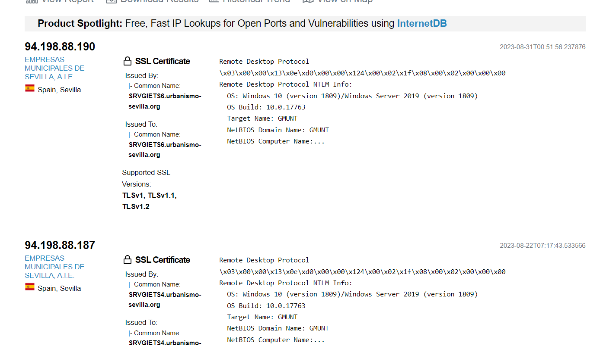

Estos últimos días han surgido varias noticias sobre el ataque que se realizó al Ayuntamiento de Sevilla por parte de un grupo de hackers. En este artículo vamos a intentar reunir la información disponible y poder contestar las dudas que podamos tener al respecto; estas serán algo incompletas pues la información es bastante escasa.

<!--truncate-->

## Control de la información
Antes de seguir, quiero aclarar el problema que existe en estos casos para saber lo que realmente pasó; esto es algo que se aplica también a empresas. Cuando ocurre algo así, en este caso al Ayuntamiento, al estado no le interesa decir exactamente qué ha pasado. Por ese mismo motivo no se encuentra mucha información sobre el ataque o daño causado; esto se hace porque así no muestran lo débil que era su seguridad o si hay datos de personas perjudicadas que puedan denunciarles.

Al final, todo esto acabará saliendo a la luz en algún momento, si se han filtrado algún dato personal o sensible de civiles u organismos, pero a día de hoy la opacidad sobre lo ocurrido es bastante alta, manteniendo siempre el mensaje de que todo se está solucionando y que todo va bien, o que nada ha sido perjudicado. Podríamos decir que esta es la actuación estándar de la empresa u organismo afectado en casos así.

## Grupo LockBit

Aunque no está confirmado, se adjudica este ataque al grupo LockBit. Este grupo holandés de hackers se hizo muy famoso por su forma de trabajar. Ellos crearon el ransomware con el mismo nombre, LockBit. Según expertos en ciberseguridad, la mayor habilidad de su líder no era tener habilidades sobresalientes en la programación sino el enfoque empresarial que tuvieron desde el inicio. Este enfoque empresarial les llevó a ofrecer su software como RaaS (Ransomware-as-a-Service); esto consiste en que ofrecen una licencia de uso a clientes, y esto permite usar el programa LockBit, el cual se actualiza y ofrece soporte por parte del grupo hacker. Generalmente, este tipo de software es bastante caro y se espera una funcionalidad muy eficiente.

### Caída de LockBit

A medida que su fama fue creciendo, fueron realizando más ataques a objetivos más variados. Esto trajo varios problemas, como estar cada vez más en el punto de mira de organizaciones como el FBI u otras similares. Aunque es bastante complicado detener este tipo de grupos porque no suelen ser jerárquicos ni tener jefes, aparte de usar comunicaciones cifradas o redes propias como puede ser usando Freenet. Por eso, grupos como Anonymous son más complicados, ya que suelen hacer ataques coordinados por redes sociales, sin conocerse entre ellos. También hacen uso de redes con PC infectados por los típicos cracks de juegos pirata o programas pirateados, pudiendo ocultar así sus localizaciones detrás de esa red botnet o usarlos para un ataque DDoS.

Pero cuando se convierte en un negocio suele surgir una organización jerárquica con un jefe, como es este caso.

También aumentaron las exigencias de los clientes por tener un software que funcionara ante los parcheos, pero el grupo no fue capaz de dar ese soporte al ritmo que se esperaba.

Hay que tener en cuenta que la forma del ataque de ransomware sería la conocida como cuádruple extorsión, que consiste en obtener la información y cifrarla. Esto le permite pedir un rescate económico amenazando a la empresa a cambio de recuperar sus datos sensibles, pero al mismo tiempo de poder volver a iniciar el trabajo ya que le es imposible trabajar, afectando también a empresas asociadas. Al final, la presión ejercida es bastante alta porque tu empresa está perdiendo dinero por no funcionar, tus clientes o empresas que hacen uso de tu infraestructura también, y puedes meterte en problemas legales si se filtran los datos sensibles.

Empezaron a hacer ataques donde amenazaban de tener datos y que iban a publicarlos, pero se demostraba que eso era mentira y no tenían nada. También lanzaron versiones más nuevas de su software, pero este se descubrió que contenía código del software de otros grupos de la competencia. Esto se supo debido a la filtración de un desarrollador del grupo que reveló el código de su software, haciendo perder la confianza en ellos y permitiendo que se descifre su encriptación. Debido a estos problemas, el líder y principal programador desapareció durante un mes o dos; a día de hoy volvió a su puesto, pero se sabe que el grupo anda un poco roto.

### Financiación del grupo

Como dijimos anteriormente, su software se vende mediante licencias de uso. Este es un software fácil de usar, pensado para pulsar un botón y atacar a la víctima. Esta herramienta hace uso de otras de forma automática, algunas propias y otras existentes, lo que le permite no ser detectado por antivirus o realizar ataques automatizados.

Del dinero que se saca a la víctima de un ataque, el cliente también paga una parte o comisión al grupo. Pero debido a los problemas mencionados anteriormente, donde están perdiendo la confianza de sus clientes, posiblemente ya no manejen tantos ingresos. También gastaron dinero tontamente pagando a personas porque se tatuaran el logo del grupo, y otras veces lo gastaron de una forma más eficiente ofreciendo un millón a quien descubriera fallos o integrantes del grupo. Esto último les sirve para saber sus vulnerabilidades propias.

## Hackeo del Ayuntamiento de Sevilla

Una vez visto todo lo anterior, ahora hablemos de forma resumida qué pasó en este caso. Aunque antes mencionemos una información curiosa al respecto, y es que este mismo grupo ya hizo un ataque anterior al mismo Ayuntamiento. En aquel caso, hicieron un ataque man-in-the-middle, lo que les permitió suplantar la identidad de una empresa encargada de poner las luces de Navidad. Dicha empresa tenía un contrato de 1 millón de euros; ellos, al suplantarlos, consiguieron contactar con la agencia tributaria pidiendo un cambio en la cuenta donde iba a hacer el ingreso de dicho contrato, robando así el dinero.

### Vulnerabilidades en el Ayuntamiento

Por desgracia, en los organismos del estado, a veces se toman las medidas o políticas de seguridad como algo sin importancia. Generalmente, los empleados no tienen ningún tipo de formación en medidas de seguridad, usando contraseñas débiles o usándola en más sitios, accediendo a correos falsos, introduciendo dispositivos de fuera, etc.

En este caso, se cree que el ataque se debió al protocolo RDP, pues con un escaneo de Shodan podemos ver que tienen los puertos abiertos de forma directa a internet, sin tenerlos detrás de una VPN ni un sistema de autenticación NLA que les permita parar un ataque haica la autenticacion ya sea fuerza bruta u otros metodos.

::info Autenticación a nivel de red (NLA, por sus siglas en inglés: Network Level Authentication)
NLA es una medida de seguridad que requiere que los usuarios se autentiquen antes de establecer una sesión de Escritorio Remoto (RDP) con un servidor o sistema remoto. A diferencia de la autenticación estándar de RDP, donde la autenticación se realiza después de que se establece la conexión, NLA garantiza que los usuarios no puedan acceder a la pantalla de inicio de sesión del sistema remoto hasta que hayan demostrado su identidad.
:::

Tampoco sabemos si tenían parcheada la vulnerabilidad BlueKeep del protocolo RDP, aunque conociendo estos organismos, posiblemente no estuviese parcheada. Esto permitió al atacante colarse en la red del Ayuntamiento y lanzar su ransomware.

:::info Vulnerabilidad BlueKeep (CVE-2019-0708)
BlueKeep es una vulnerabilidad de seguridad que existe en los servicios de Escritorio Remoto (RDP) de Microsoft Windows. Esta vulnerabilidad permite la ejecución remota de código sin la necesidad de autenticación, lo que significa que un atacante podría tomar el control completo de un sistema afectado.
:::

A continuación dejaré una captura del escaneo de puerto, donde podremos ver que efectivamente el puerto del protocolo rdp así como el servicio estaba expuesto a internet sin la autenticación NLA.

### Medidas tomadas y daño causado

Por parte de la autoridad certificadora de España, se ha revocado todos los certificados digitales para impedir que los atacantes lo usen y obtener acceso a otros lugares u organismos. También se ha creado una intranet para poder trabajar en solucionar este problema e impedir que haya acceso a internet o el exterior.

Los atacantes empezaron pidiendo 1 millón, aunque actualmente su cifra es de 5 millones. El coste del daño causado es realmente desconocido, pues como explicamos en el primer punto, al organismo afectado no le interesa que se sepa el alcance del daño. Aunque este daño lo iremos sabiendo a medida que avancen los días, pues si hubo filtraciones, acabarán saliendo a la luz, así como cualquier robo de dinero.

### Prevención

Todo esto se podría haber prevenido seguramente o, en su defecto, habérselo puesto más difícil. Es necesario más formación a los empleados, así como parchear las vulnerabilidades y tomar medidas de seguridad. En este caso, es todavía más grave porque fueron avisados hace meses por INCIBE de que no cumplían las medidas de seguridad, pero les importó poco.

## Conclusión

El ataque al Ayuntamiento de Sevilla es un recordatorio de la importancia de la ciberseguridad en la era digital. Aunque las entidades pueden ser reacias a divulgar detalles, es esencial aprender de estos incidentes y adoptar medidas preventivas para protegerse en el futuro. La ciberseguridad no es solo una cuestión técnica, sino también organizativa y cultural, y requiere un enfoque holístico para ser efectiva.