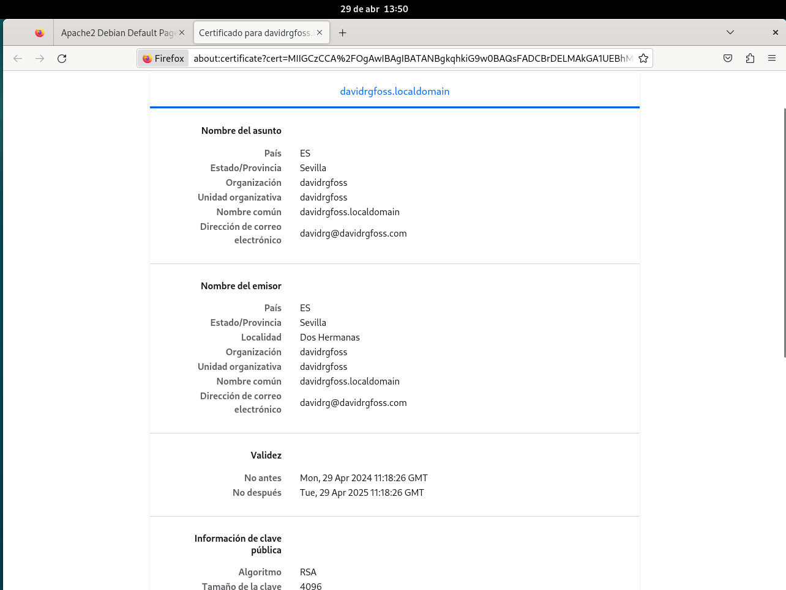
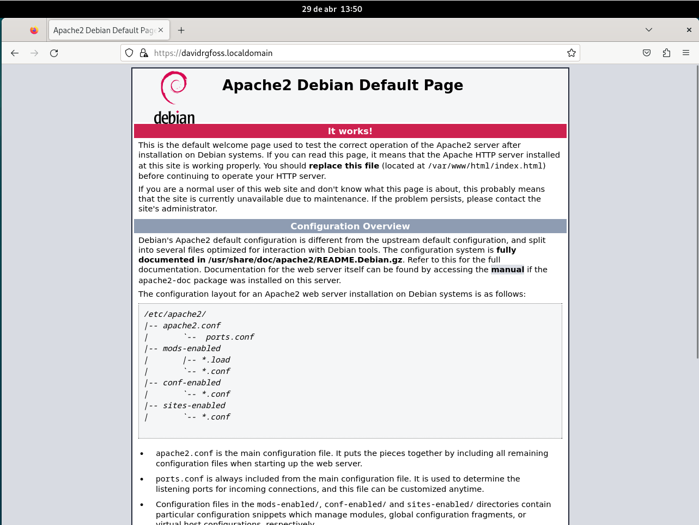
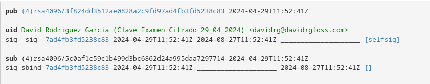

Examen de cifrado

<!--truncate-->

# Autoridad certificadora

## Crea una autoridad certificadora.

* Crear directorios necesarios
```bash
mkdir /home/davidrg/CA
mkdir /home/davidrg/CA/private
mkdir /home/davidrg/CA/newcerts
mkdir /home/davidrg/CA/certs
touch /home/davidrg/CA/index.txt
echo '01' > /home/davidrg/CA/serial
chmod 700 /home/davidrg/CA/private
```
* Configuramos '/etc/ssl/openssl.cnf' para adaptarlo a nuestra configuración. Realmente lo ideal seria separar esta entidad certificadora en otro grupo que no sea `Default` para asi tener cada configuración, pero como esta maquina sera solo para el examen cambiamos la dirección del default y el resto ya debe estar configurado como indicare a continuación.
```bash
[ CA_default ]
dir             = /home/davidrg/CA
private_key     = $dir/private/cakey.pem
certificate     = $dir/cacert.pem
new_certs_dir   = $dir/newcerts
database        = $dir/index.txt
serial          = $dir/serial
```

* Generamos la clave privada del servidor y la solicitud de certificado
```bash
openssl genrsa -out /home/davidrg/CA/private/server.key 4096
openssl req -new -key /home/davidrg/CA/private/server.key -out /home/davidrg/CA/private/server.csr
```

* Creamos la clave privada y el certificado de la CA que vamos a crear
```bash
openssl genrsa -aes256 -out /home/davidrg/CA/private/cakey.pem 4096
openssl req -new -x509 -days 3650 -key /home/davidrg/CA/private/cakey.pem -out /home/davidrg/CA/cacert.pem
```

## Genera una CSR para un servidor HTTPS que deberás montar con nginx

* Creamos la firma CSR con la CA que hemos creado en el paso anterior
```bash
openssl ca -in /home/davidrg/CA/private/server.csr -out /home/davidrg/CA/certs/server.crt -days 365
```

## Configura el servidor nginx adecuadamente con la información proporcionada por la autoridad certificadora como respuesta a la CSR.

* Activamos el mod de ssl y activamos el sitio default con ssl.

```bash
a2dissite 000-default
a2enmod ssl
a2ensite default-ssl
systemctl restart apache2
```

* Fichero con el host configurado, tambien podemos modificar el `/etc/apache2/sites-available/default-ssl.conf`. Cambiando las lineas `SSLCertificateFile` y SSLCertificateKeyFile` añadiendo la ruta hacia las clave, en este caso quedaria asi:

```bash
<VirtualHost *:443>
	ServerAdmin webmaster@localhost
	ServerName davidrgfoss.localdomain
	DocumentRoot /var/www/html

	# Available loglevels: trace8, ..., trace1, debug, info, notice, warn,
	# error, crit, alert, emerg.
	# It is also possible to configure the loglevel for particular
	# modules, e.g.
	#LogLevel info ssl:warn

	ErrorLog ${APACHE_LOG_DIR}/error.log
	CustomLog ${APACHE_LOG_DIR}/access.log combined

	# For most configuration files from conf-available/, which are
	# enabled or disabled at a global level, it is possible to
	# include a line for only one particular virtual host. For example the
	# following line enables the CGI configuration for this host only
	# after it has been globally disabled with "a2disconf".
	#Include conf-available/serve-cgi-bin.conf

	#   SSL Engine Switch:
	#   Enable/Disable SSL for this virtual host.
	SSLEngine on

	#   A self-signed (snakeoil) certificate can be created by installing
	#   the ssl-cert package. See
	#   /usr/share/doc/apache2/README.Debian.gz for more info.
	#   If both key and certificate are stored in the same file, only the
	#   SSLCertificateFile directive is needed.
	SSLCertificateFile      /home/davidrg/CA/certs/server.crt
	SSLCertificateKeyFile   /home/davidrg/CA/private/server.key

	#   Server Certificate Chain:
	#   Point SSLCertificateChainFile at a file containing the
	#   concatenation of PEM encoded CA certificates which form the
	#   certificate chain for the server certificate. Alternatively
	#   the referenced file can be the same as SSLCertificateFile
	#   when the CA certificates are directly appended to the server
	#   certificate for convinience.
	#SSLCertificateChainFile /etc/apache2/ssl.crt/server-ca.crt

	#   Certificate Authority (CA):
	#   Set the CA certificate verification path where to find CA
	#   certificates for client authentication or alternatively one
	#   huge file containing all of them (file must be PEM encoded)
	#   Note: Inside SSLCACertificatePath you need hash symlinks
	#	  to point to the certificate files. Use the provided
	#	  Makefile to update the hash symlinks after changes.
	#SSLCACertificatePath /etc/ssl/certs/
	#SSLCACertificateFile /etc/apache2/ssl.crt/ca-bundle.crt

	#   Certificate Revocation Lists (CRL):
	#   Set the CA revocation path where to find CA CRLs for client
	#   authentication or alternatively one huge file containing all
	#   of them (file must be PEM encoded)
	#   Note: Inside SSLCARevocationPath you need hash symlinks
	#	  to point to the certificate files. Use the provided
	#	  Makefile to update the hash symlinks after changes.
	#SSLCARevocationPath /etc/apache2/ssl.crl/
	#SSLCARevocationFile /etc/apache2/ssl.crl/ca-bundle.crl

	#   Client Authentication (Type):
	#   Client certificate verification type and depth.  Types are
	#   none, optional, require and optional_no_ca.  Depth is a
	#   number which specifies how deeply to verify the certificate
	#   issuer chain before deciding the certificate is not valid.
	#SSLVerifyClient require
	#SSLVerifyDepth  10

	#   SSL Engine Options:
	#   Set various options for the SSL engine.
	#   o FakeBasicAuth:
	#    Translate the client X.509 into a Basic Authorisation.  This means that
	#    the standard Auth/DBMAuth methods can be used for access control.  The
	#    user name is the `one line' version of the client's X.509 certificate.
	#    Note that no password is obtained from the user. Every entry in the user
	#    file needs this password: `xxj31ZMTZzkVA'.
	#   o ExportCertData:
	#    This exports two additional environment variables: SSL_CLIENT_CERT and
	#    SSL_SERVER_CERT. These contain the PEM-encoded certificates of the
	#    server (always existing) and the client (only existing when client
	#    authentication is used). This can be used to import the certificates
	#    into CGI scripts.
	#   o StdEnvVars:
	#    This exports the standard SSL/TLS related `SSL_*' environment variables.
	#    Per default this exportation is switched off for performance reasons,
	#    because the extraction step is an expensive operation and is usually
	#    useless for serving static content. So one usually enables the
	#    exportation for CGI and SSI requests only.
	#   o OptRenegotiate:
	#    This enables optimized SSL connection renegotiation handling when SSL
	#    directives are used in per-directory context.
	#SSLOptions +FakeBasicAuth +ExportCertData +StrictRequire
	<FilesMatch "\.(?:cgi|shtml|phtml|php)$">
		SSLOptions +StdEnvVars
	</FilesMatch>
	<Directory /usr/lib/cgi-bin>
		SSLOptions +StdEnvVars
	</Directory>

	#   SSL Protocol Adjustments:
	#   The safe and default but still SSL/TLS standard compliant shutdown
	#   approach is that mod_ssl sends the close notify alert but doesn't wait for
	#   the close notify alert from client. When you need a different shutdown
	#   approach you can use one of the following variables:
	#   o ssl-unclean-shutdown:
	#    This forces an unclean shutdown when the connection is closed, i.e. no
	#    SSL close notify alert is send or allowed to received.  This violates
	#    the SSL/TLS standard but is needed for some brain-dead browsers. Use
	#    this when you receive I/O errors because of the standard approach where
	#    mod_ssl sends the close notify alert.
	#   o ssl-accurate-shutdown:
	#    This forces an accurate shutdown when the connection is closed, i.e. a
	#    SSL close notify alert is send and mod_ssl waits for the close notify
	#    alert of the client. This is 100% SSL/TLS standard compliant, but in
	#    practice often causes hanging connections with brain-dead browsers. Use
	#    this only for browsers where you know that their SSL implementation
	#    works correctly.
	#   Notice: Most problems of broken clients are also related to the HTTP
	#   keep-alive facility, so you usually additionally want to disable
	#   keep-alive for those clients, too. Use variable "nokeepalive" for this.
	#   Similarly, one has to force some clients to use HTTP/1.0 to workaround
	#   their broken HTTP/1.1 implementation. Use variables "downgrade-1.0" and
	#   "force-response-1.0" for this.
	# BrowserMatch "MSIE [2-6]" \
	#	nokeepalive ssl-unclean-shutdown \
	#	downgrade-1.0 force-response-1.0

</VirtualHost>
```

## Documenta el proceso completo con capturas de pantalla del día de hoy, demostrando que el servidor es accesible por HTTPS en el puerto 443 con su certificado recién firmado por la CA (Debes mostrar la fecha de creación del certificado). (6 puntos)

* Aqui pondre algunas imagenes del proceso realizado como prueba que se realizo hoy.








