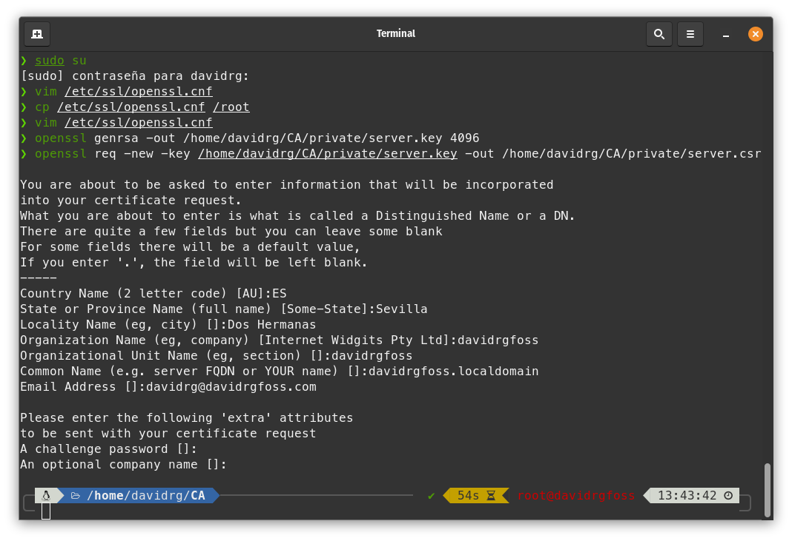
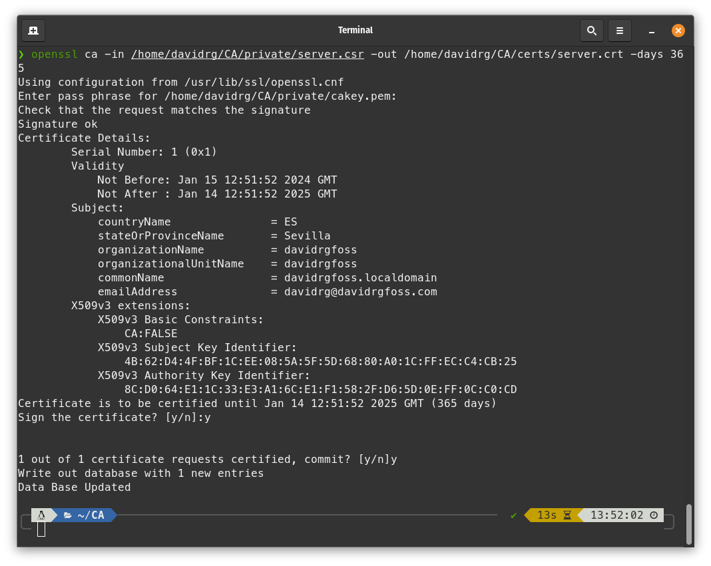
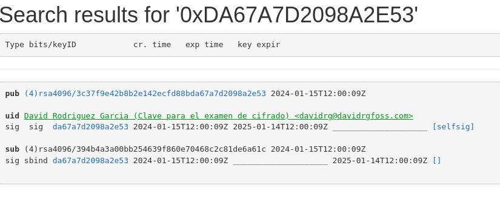

Examen de cifrado

<!--truncate-->

# Autoridad certificadora

## Crea una autoridad certificadora.

* Crear directorios necesarios
```bash
mkdir /home/davidrg/CA
mkdir /home/davidrg/CA/private
mkdir /home/davidrg/CA/newcerts
mkdir /home/davidrg/CA/certs
touch /home/davidrg/CA/index.txt
echo '01' > /home/davidrg/CA/serial
chmod 700 /home/davidrg/CA/private
```
* Configuramos '/etc/ssl/openssl.cnf' para adaptarlo a nuestra configuración. Realmente lo ideal seria separar esta entidad certificadora en otro grupo que no sea `Default` para asi tener cada configuración, pero como esta maquina sera solo para el examen cambiamos la dirección del default y el resto ya debe estar configurado como indicare a continuación.
```bash
[ CA_default ]
dir             = /home/davidrg/CA
private_key     = $dir/private/cakey.pem
certificate     = $dir/cacert.pem
new_certs_dir   = $dir/newcerts
database        = $dir/index.txt
serial          = $dir/serial
```

* Generamos la clave privada del servidor y la solicitud de certificado
```bash
openssl genrsa -out /home/davidrg/CA/private/server.key 4096
openssl req -new -key /home/davidrg/CA/private/server.key -out /home/davidrg/CA/private/server.csr
You are about to be asked to enter information that will be incorporated
into your certificate request.
What you are about to enter is what is called a Distinguished Name or a DN.
There are quite a few fields but you can leave some blank
For some fields there will be a default value,
If you enter '.', the field will be left blank.
-----
Country Name (2 letter code) [AU]:ES
State or Province Name (full name) [Some-State]:Sevilla
Locality Name (eg, city) []:Dos Hermanas
Organization Name (eg, company) [Internet Widgits Pty Ltd]:davidrgfoss
Organizational Unit Name (eg, section) []:davidrgfoss
Common Name (e.g. server FQDN or YOUR name) []:davidrgfoss.localdomain
Email Address []:davidrg@davidrgfoss.com

Please enter the following 'extra' attributes
to be sent with your certificate request
A challenge password []:
An optional company name []:
```

* Creamos la clave privada y el certificado de la CA que vamos a crear
```bash
openssl genrsa -aes256 -out /home/davidrg/CA/private/cakey.pem 4096
Enter PEM pass phrase:
Verifying - Enter PEM pass phrase:

openssl req -new -x509 -days 3650 -key /home/davidrg/CA/private/cakey.pem -out /home/davidrg/CA/cacert.pem
Enter pass phrase for /home/davidrg/CA/private/cakey.pem:
You are about to be asked to enter information that will be incorporated
into your certificate request.
What you are about to enter is what is called a Distinguished Name or a DN.
There are quite a few fields but you can leave some blank
For some fields there will be a default value,
If you enter '.', the field will be left blank.
-----
Country Name (2 letter code) [AU]:ES
State or Province Name (full name) [Some-State]:Sevilla
Locality Name (eg, city) []:Dos Hermanas
Organization Name (eg, company) [Internet Widgits Pty Ltd]:davidrgfoss
Organizational Unit Name (eg, section) []:davidrgfoss
Common Name (e.g. server FQDN or YOUR name) []:davidrgfoss.localdomain
Email Address []:davidrg@davidrgfoss.com
```

## Genera una CSR para un servidor HTTPS que deberás montar con nginx

* Creamos la firma CSR con la CA que hemos creado en el paso anterior
```bash
openssl ca -in /home/davidrg/CA/private/server.csr -out /home/davidrg/CA/certs/server.crt -days 365
Using configuration from /usr/lib/ssl/openssl.cnf
Enter pass phrase for /home/davidrg/CA/private/cakey.pem:
Check that the request matches the signature
Signature ok
Certificate Details:
        Serial Number: 1 (0x1)
        Validity
            Not Before: Jan 15 12:51:52 2024 GMT
            Not After : Jan 14 12:51:52 2025 GMT
        Subject:
            countryName               = ES
            stateOrProvinceName       = Sevilla
            organizationName          = davidrgfoss
            organizationalUnitName    = davidrgfoss
            commonName                = davidrgfoss.localdomain
            emailAddress              = davidrg@davidrgfoss.com
        X509v3 extensions:
            X509v3 Basic Constraints: 
                CA:FALSE
            X509v3 Subject Key Identifier: 
                4B:62:D4:4F:BF:1C:EE:08:5A:5F:5D:68:80:A0:1C:FF:EC:C4:CB:25
            X509v3 Authority Key Identifier: 
                8C:D0:64:E1:1C:33:E3:A1:6C:E1:F1:58:2F:D6:5D:0E:FF:0C:C0:CD
Certificate is to be certified until Jan 14 12:51:52 2025 GMT (365 days)
Sign the certificate? [y/n]:y


1 out of 1 certificate requests certified, commit? [y/n]y
Write out database with 1 new entries
Data Base Updated
```

## Configura el servidor nginx adecuadamente con la información proporcionada por la autoridad certificadora como respuesta a la CSR.

* Fichero con el host configurado, tambien podemos modificar el `/etc/nginx/sites-available/default`.

```bash
server {
    # IPv4.
    listen 80;
    listen 443 ssl http2;

    # IPv6.
    # listen [::]:80;
    # listen [::]:443 ssl http2;

    server_name cifrado.davidrgfoss.com;

    access_log /var/log/nginx/example.com-access.log;
    error_log /var/log/nginx/example.com-error.log;

    ssl_certificate /home/davidrg/CA/certs/server.crt;
    ssl_certificate_key /home/davidrg/CA/private/server.key;
    root /var/www/cifrado;

    index index.php;
	location / {
		try_files $uri $uri/ /index.html;
	}
}
```

## Documenta el proceso completo con capturas de pantalla del día de hoy, demostrando que el servidor es accesible por HTTPS en el puerto 443 con su certificado recién firmado por la CA (Debes mostrar la fecha de creación del certificado). (6 puntos)

* Aqui pondre algunas imagenes del proceso realizado como prueba que se realizo hoy.





# Operaciones con GPG y OpenSSL

## Crea un par de claves nuevo y sube tu clave pública al servidor de claves de Ubuntu o al del MIT. Adjunta captura que demuestre que la clave se ha subido correctamente en el día de hoy.

* Crear clave con GPG
```bash
gpg --full-generate-key
gpg (GnuPG) 2.2.27; Copyright (C) 2021 Free Software Foundation, Inc.
This is free software: you are free to change and redistribute it.
There is NO WARRANTY, to the extent permitted by law.

Por favor seleccione tipo de clave deseado:
   (1) RSA y RSA (por defecto)
   (2) DSA y ElGamal
   (3) DSA (sólo firmar)
   (4) RSA (sólo firmar)
  (14) Existing key from card
Su elección: 1
las claves RSA pueden tener entre 1024 y 4096 bits de longitud.
¿De qué tamaño quiere la clave? (3072) 4096
El tamaño requerido es de 4096 bits
Por favor, especifique el período de validez de la clave.
         0 = la clave nunca caduca
      <n>  = la clave caduca en n días
      <n>w = la clave caduca en n semanas
      <n>m = la clave caduca en n meses
      <n>y = la clave caduca en n años
¿Validez de la clave (0)? 1y
La clave caduca mar 14 ene 2025 12:59:44 CET
¿Es correcto? (s/n) s

GnuPG debe construir un ID de usuario para identificar su clave.

Nombre y apellidos: David Rodriguez Garcia
Dirección de correo electrónico: davidrg@davidrgfoss.com
Comentario: Clave para el examen de cifrado
Ha seleccionado este ID de usuario:
    "David Rodriguez Garcia (Clave para el examen de cifrado) <davidrg@davidrgfoss.com>"

¿Cambia (N)ombre, (C)omentario, (D)irección o (V)ale/(S)alir? V
Es necesario generar muchos bytes aleatorios. Es una buena idea realizar
alguna otra tarea (trabajar en otra ventana/consola, mover el ratón, usar
la red y los discos) durante la generación de números primos. Esto da al
generador de números aleatorios mayor oportunidad de recoger suficiente
entropía.
Es necesario generar muchos bytes aleatorios. Es una buena idea realizar
alguna otra tarea (trabajar en otra ventana/consola, mover el ratón, usar
la red y los discos) durante la generación de números primos. Esto da al
generador de números aleatorios mayor oportunidad de recoger suficiente
entropía.
gpg: clave DA67A7D2098A2E53 marcada como de confianza absoluta
gpg: certificado de revocación guardado como '/home/davidrg/.gnupg/openpgp-revocs.d/3C37F9E42B8B2E142ECFD88BDA67A7D2098A2E53.rev'
claves pública y secreta creadas y firmadas.

pub   rsa4096 2024-01-15 [SC] [caduca: 2025-01-14]
      3C37F9E42B8B2E142ECFD88BDA67A7D2098A2E53
uid                      David Rodriguez Garcia (Clave para el examen de cifrado) <davidrg@davidrgfoss.com>
sub   rsa4096 2024-01-15 [E] [caduca: 2025-01-14]
```
* Subir clave al `keyserver` de `Ubuntu`

```bash
gpg --keyserver keyserver.ubuntu.com --send-keys 3C37F9E42B8B2E142ECFD88BDA67A7D2098A2E53
gpg: enviando clave DA67A7D2098A2E53 a hkp://keyserver.ubuntu.com
```
* Captura de pantalla donde la clave se ve subida al servidor.



## Manda un correo a raulpruebas21@gmail.com adjuntando tu clave pública recién creada como texto ASCII.

* Exportar clave publica a un fichero ASCII
```bash
gpg -a --export 3C37F9E42B8B2E142ECFD88BDA67A7D2098A2E53 > david.asc
```

## Cifra un fichero de texto de forma simétrica con la clave “Shalamakuki” usando OpenSSL.

* Creamos el fichero y lo ciframos
```bash
echo "hola mundo" > ej3.txt
openssl enc -aes-256-cbc -salt -in ej3.txt -out ej3_cifrado.txt.enc -pass pass:Shalamakuki -pbkdf2
```

## Manda ese fichero como adjunto en un mensaje de correo electrónico cifrado y firmado por tí con el par de claves creado en este mismo ejercicio a la misma dirección anterior. En el texto del correo escribirás el comando usado para realizar el apartado c)

* Exportamos clave privada para usarla en thunderbird
```bash
gpg --export-secret-keys 3C37F9E42B8B2E142ECFD88BDA67A7D2098A2E53 > davidrg.key
```

* Importamos la clave publica asociada al correo raulpruebas21@gmail.com
```bash
gpg --keyserver keyserver.ubuntu.com --recv-keys 3b677bf541cb4d92
```

